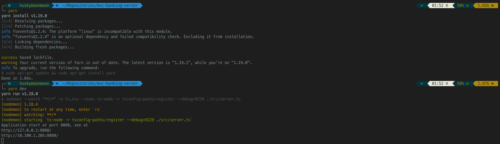
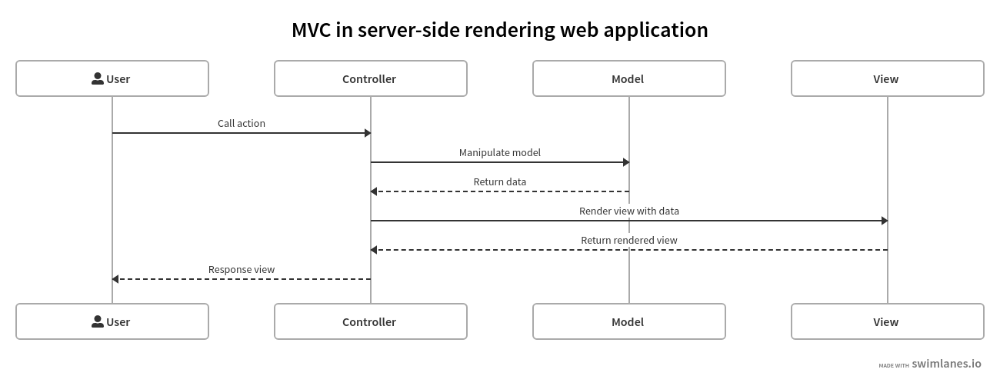

# MVC Web application in NodeJS
--------------------------------
ตัวอย่างโปรแกรม MVC web application

**Table of Content**
- [# MVC Web application in NodeJS](#mvc-web-application-in-nodejs)
- [- เมื่อไหร่ควรใช้ Service](#%e0%b9%80%e0%b8%a1%e0%b8%b7%e0%b9%88%e0%b8%ad%e0%b9%84%e0%b8%ab%e0%b8%a3%e0%b9%88%e0%b8%84%e0%b8%a7%e0%b8%a3%e0%b9%83%e0%b8%8a%e0%b9%89-service)
- [ก่อนเริ่ม](#%e0%b8%81%e0%b9%88%e0%b8%ad%e0%b8%99%e0%b9%80%e0%b8%a3%e0%b8%b4%e0%b9%88%e0%b8%a1)
- [Preface](#preface)
- [Technology stack](#technology-stack)
- [Development environment setup](#development-environment-setup)
- [How to launch program](#how-to-launch-program)
- [Project folder structure](#project-folder-structure)
- [คำถามที่ถามบ่อย](#%e0%b8%84%e0%b8%b3%e0%b8%96%e0%b8%b2%e0%b8%a1%e0%b8%97%e0%b8%b5%e0%b9%88%e0%b8%96%e0%b8%b2%e0%b8%a1%e0%b8%9a%e0%b9%88%e0%b8%ad%e0%b8%a2)
  - [What is MVC](#what-is-mvc)
    - [Flow การ interact ระหว่าง Model-View-Controller ใน server-side rendering web application](#flow-%e0%b8%81%e0%b8%b2%e0%b8%a3-interact-%e0%b8%a3%e0%b8%b0%e0%b8%ab%e0%b8%a7%e0%b9%88%e0%b8%b2%e0%b8%87-model-view-controller-%e0%b9%83%e0%b8%99-server-side-rendering-web-application)
  - [Model ใน MVC คืออะไรกันแน่](#model-%e0%b9%83%e0%b8%99-mvc-%e0%b8%84%e0%b8%b7%e0%b8%ad%e0%b8%ad%e0%b8%b0%e0%b9%84%e0%b8%a3%e0%b8%81%e0%b8%b1%e0%b8%99%e0%b9%81%e0%b8%99%e0%b9%88)
  - [Logic ควรอยู่ที่ไหน?](#logic-%e0%b8%84%e0%b8%a7%e0%b8%a3%e0%b8%ad%e0%b8%a2%e0%b8%b9%e0%b9%88%e0%b8%97%e0%b8%b5%e0%b9%88%e0%b9%84%e0%b8%ab%e0%b8%99)
  - [เมื่อไหร่ควรใช้ Service](#%e0%b9%80%e0%b8%a1%e0%b8%b7%e0%b9%88%e0%b8%ad%e0%b9%84%e0%b8%ab%e0%b8%a3%e0%b9%88%e0%b8%84%e0%b8%a7%e0%b8%a3%e0%b9%83%e0%b8%8a%e0%b9%89-service)
-----------------------------
## ก่อนเริ่ม
- โค้ดเขียนพอให้ใช้ได้ใน 3 ชั่วโมง ดังนั้น not ready for production
- อ่านให้จบ
- มีปัญหาอะไรเกิดขึ้น หรืออยากแก้ไข เปิด issues, pull request มาได้เต็มที่


## Preface
Code นี้ implement โจทย์ข้อธนาคารในการสอบ Exit Exam @CSKMITL ประจำปีการศึกษา 2561 โดยโจทย์กำหนดให้มีบัญชีธนาคาร 3 บัญชี โดยเจ้าของบัญชีสามารถ login โดยใช้เลขที่บัญชี, Passcode เพื่อทำรายการต่างๆ 3 อย่างได้แก่
- การฝากเงิน
- การถอนเงิน
- การโอนเงินข้ามบัญชี

โดยออกแบบหน้าจอให้เหมาะสม

## Technology stack
- Runtime: NodeJS
- Language: [TypeScript](https://www.typescriptlang.org/)
- Web framework: [routing-controllers](https://github.com/typestack/routing-controllers) with Koa.js ([Koa.js](https://koajs.com/))
- View template: [lit-ntml](https://github.com/motss/lit-ntml)
- CSS, Front-End Component: [Bootstrap](https://getbootstrap.com/)
- Database helper: [knexjs]() 

## Development environment setup
- [Visual Studio Code](https://code.visualstudio.com/) with extensions 
  - TSLint สำหรับ TypeScript linting
  - lit-plugin สำหรับ lit-ntml syntax hilighting & completion
- [NodeJS LTS version](https://nodejs.org/en/)
- [Yarn package manager](https://yarnpkg.com/lang/en/)
- ติดตั้ง module `typescript` และ `tslint` เป็น global module ผ่าน command line
    ```bash
    > yarn add -g typescript tslint
    ```

## How to launch program
  1. เปิด command prompt ที่โฟลเดอร์โปรแกรม หรือเปิดโฟลเดอร์โปรแกรมด้วย vscode แล้วเปิด integrated command prompt ขึ้นมา
  2. รันคำสั่ง
     ```bash
      > yarn
      ```
     รอจน yarn รันเสร็จ
  3. รันคำสั่ง 
     ```bash
     > yarn dev
     ```
  โปรแกรมจะรันโดยใช้ port ที่ตั้งค่าไว้ในไฟล์ .env (ค่าเริ่มต้นคือ 8080)
  

## Project folder structure
- src: โค้ดโปรแกรม
  - assets: bootstrap, js, css ของหน้าเว็บ
  - controllers: controllers
  - core: คลาสหลักๆ ของ boilerplate
  - models: model class / entity class
  - repository: ส่วนติดต่อ data source
  - services: service layer
  - views: html template
  - index.ts: ไฟล์เริ่มต้นการทำงาน
- .env: ไฟล์ config

## คำถามที่ถามบ่อย

### What is MVC
MVC (Model-View-Controller) เป็น design pattern รูปแบบหนึ่งที่ใช้กับโปรแกรมที่มี GUI เป็นหลัก โดยแยกโค้ดออกเป็นส่วนๆ ตามหน้าที่ที่รับผิดชอบ (Separation of Concern: SoC)

โดยหลักการคิดในการออกแบบโปรแกรมตามโครงสร้าง MVC จะประกอบไปด้วย 3 ขั้นตอนหลักๆ คือ 
1. How you model your data  (**Model** โมเดลข้อมูล)
2. How you display your data (**View** การแสดงผล)
3. How you interact with your data (**Controller** เรียก/เปลี่ยนแปลงข้อมูลจาก model แล้ว update view ส่งให้ user ตาม action)

#### Flow การ interact ระหว่าง Model-View-Controller ใน server-side rendering web application

1. เริ่มต้นด้วย user เรียก request มาทาง web browser ตาม route ที่ระบุ
2. จากนั้น controller จะทำงานตาม function ที่ระบุ route ไว้ 
3. โดย controller จะเรียกหรือเปลี่ยนแปลงข้อมูลจาก model ที่ต้องการ
4. เมื่อได้ข้อมูลก็จะส่งไปให้ view render จนได้หน้า HTML แล้วจึง response กลับไปให้ user
 
### Model ใน MVC คืออะไรกันแน่
ส่วนที่มักจะสับสนกันคือ model จริงๆ มันเป็นอะไรกันแน่ เพราะหลายบทความบอกไว้ว่า model เป็นส่วนที่ใช้ติดต่อกับ data source แต่ใน code หลายๆ ตัวอย่าง model เป็นแค่ class โง่ๆ

class โง่ๆ จริงๆ แล้วเรียกว่า Entity model (หรือเรียกว่า Entity class ก็ได้) เป็น class ที่หน้าตาเหมือนกับ entity อาจจะมีการเขียน action คลุมไว้ได้บ้างอย่างเช่น การถอนเงินออกจากบัญชีห้ามเกินจากจำนวนที่มีอยู่ เราอาจจะเขียน method `.withdraw(amount)` ไว้ใน `BankAccount` object เพื่อใม่ให้โปรแกรมเมอร์พลาด ซึ่งจะมี layer บางๆ ที่เรียกว่า Data Access Layer (DAL) เช่น **Repository** เพื่อสร้างหรือ update ข้อมูลใน data source จาก entity model อีกทีหนึ้ง

บาง framework เช่น laravel นั้น entity model จะเป็นแบบ active record สามารถใช้ในการ select, insert, update, delete ได้เลย เป็น DAL ในตัวเอง

ดังนั้น คำว่า model ใน MVC หมายถึง Entity class รวมถึง DAL เลย

### Logic ควรอยู่ที่ไหน?
แล้วแต่ ประเภทของ logic
- ถ้าเกี่ยวช้องกับ domain model เช่น `BankAccount` ไม่สามารถถอนเงินออกได้มากกว่าจำนวนเงินที่มีอยู่ logic นี้จะอยู่ที่ Model
- ถ้าเกี่ยวข้องกับการแสดงผล เช่นถ้า `a.b == 2` จะต้องแสดงปุ่ม OK logic นี้จะอยู่ที่ View
- ถ้าเกี่ยวข้องกับ flow การทำงานของโปรแกรม เช่น ถ้าตรวจสอบแล้ว user ระบุ id, passcode ถูกต้อง ให้ generate token แล้ว set cookie กลับไปด้วย logic นี้ควรอยู่ที่ controller

### เมื่อไหร่ควรใช้ Service
ไม่ตายตัว แต่ถ้าเมื่อไหร่ logic เริ่มซับซ้อนมากขึ้น เช่น
```TypeScript
    public async transfer(token: string, toAccountId: string, transferAmount: number) {
        const account = await this.validateToken(token);
        const toAccount = await this.findAccountById(toAccountId);

        if (account.accountId === toAccount.accountId) {
            throw {
                message: "Cannot transfer to the origin account",
            };
        }
        if (account.balance < transferAmount) {
            throw {
                message: "Insufficient balance.",
            };
        }
        account.balance -= transferAmount;
        toAccount.balance += transferAmount;
        this._bankAccountRepository.updateAccount(account);
        this._bankAccountRepository.updateAccount(toAccount);
        this.recordTransaction(account, transferAmount, `Transfer to account ${toAccount.accountId}`);
        this.recordTransaction(toAccount, transferAmount, `Transfer from account ${account.accountId}`);
    }
```
ตามตัวอย่าง กำหนดให้ก่อนทำการโอนต้องตรวจสอบบัญชีปลายทางว่ามีอยู่จริง และยอดเงินที่ต้องการโอนจะต้องน้อยกว่าหรือเท่ากับบัญชีปลายทาง หลังจากโอนเงินเรียกร้อยให้ทำการบันทึกรายการลงไปด้วยทั้งสองบัญชี

ดังนั้นไม่มีอะไรตายตัว แต่ถ้าความซับซ้อนเริ่มมากขึ้นก็ควรแยกออกมาเพื่อไม่ให้ model และ controller รกเกินไป
